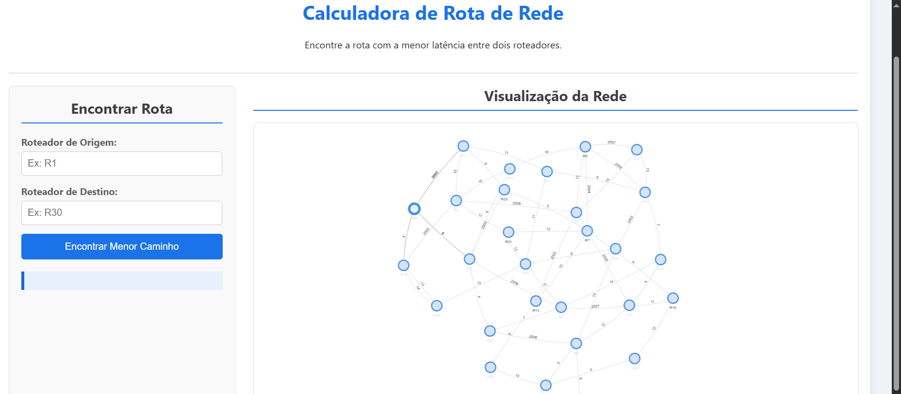
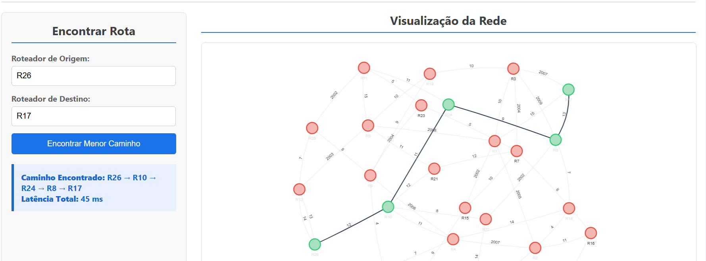
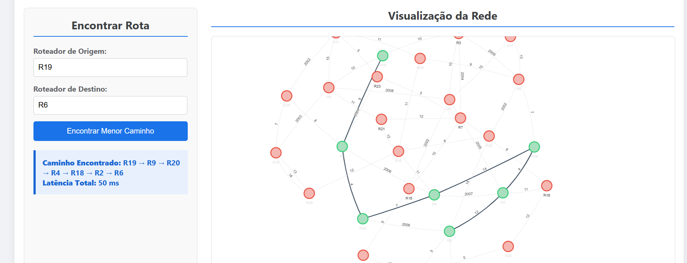

# Grafos 2 - Redes 

**Número da Lista**: Dupla 28<br>
**Conteúdo da Disciplina**: Grafos 2<br>

## Alunos
|Matrícula | Aluno |
| -- | -- |
| 20/2046229  |  Kallyne Macêdo Passos |
| 20/0022199  | Leonardo Sobrinho de Aguiar |

## Sobre 
Este projeto tem como objetivo a simulação e visualização de uma **rede de roteadores**, demonstrando de forma prática como o tráfego de dados pode ser otimizado ao encontrar o caminho mais eficiente entre dois pontos. A aplicação utiliza o **algoritmo de Dijkstra** para calcular a rota de menor custo em um grafo que representa a topologia da rede, onde cada aresta possui um peso correspondente à latência (o tempo de resposta, em milissegundos) daquela conexão específica. Através da interface web, a partir da seleção do usuário de dois roteadores distintos, o sistema calcula e exibe o caminho ótimo, ou seja, a rota que garante a transmissão de dados com o menor atraso total, ilustrando um conceito fundamental para o estudo da engenharia de redes.

## Screenshots

<center>

Página Inicial


Rota de R26 a R17


Rota de R19 a R6    


</center>


## Instalação 
**Linguagem**: Python, HTML, CSS e JavaScript<br>
**Framework**: Flask<br>
**Pré-requisitos**: Navegador Web, Python, Flask, Flask_CORS e Pandas instalados no computador; Clonar o repositório localmente.

## Passo a Passo
### 1. Clonar repositório:
```bash
https://github.com/projeto-de-algoritmos-2025/Grafos2_Redes.git
```
### 2. Instale as Dependências:
Abra um terminal ou prompt de comando na pasta do projeto e execute:
```bash
pip install Flask Flask-CORS pandas
```
### 3. Inicie o Servidor:
Digite no mesmo terminal:
```bash
python app.py
```
### 4. Acesse a Aplicação:
Abra seu navegador web e acesse o seguinte endereço: http://127.0.0.1:5001

## Uso

Selecione no grafo ou escreva o nome de dois roteadores distintos nos campos 'Roteador de Origem' e 'Roteador de Destino' e clique em 'Encontrar Menor Caminho' para que o sistema calcule o caminho de menor latência entre os disponíveis.

## Gravação  
[Link para a gravação](https://www.youtube.com/watch?v=MpDFBVqXzaA&feature=youtu.be)


